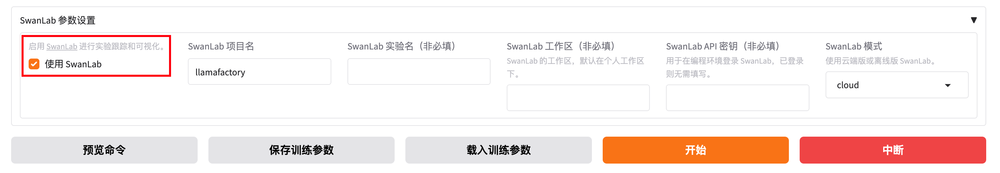
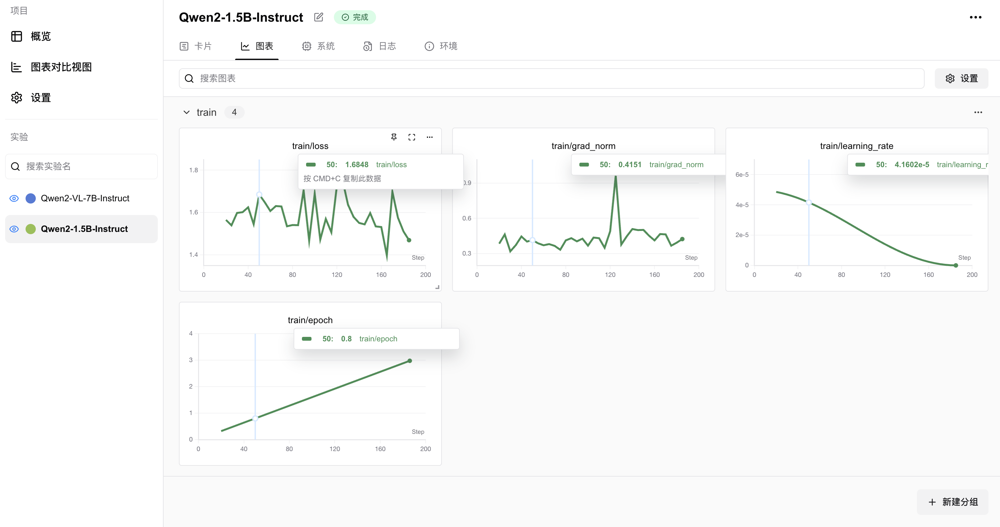
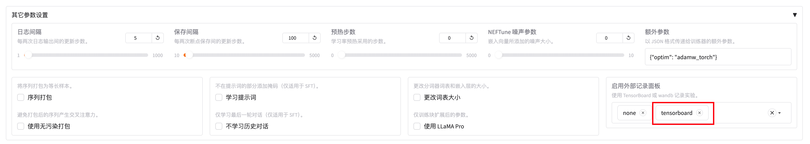
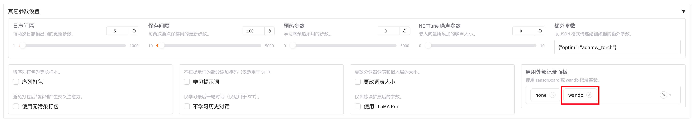
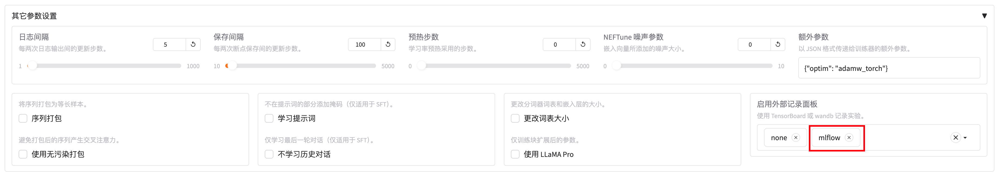

实验监控
================

LLaMA-Factory 支持多种训练可视化工具，包括：:ref:`LlamaBoard <LlamaBoard>` 、 :ref:`SwanLab <SwanLab>`、:ref:`TensorBoard <TensorBoard>` 、 :ref:`Wandb <Wandb>` 、 :ref:`MLflow <MLflow>` 。

LlamaBoard
--------------------------
.. _LlamaBoard:

LlamaBoard 是指 WebUI 中自带的Loss曲线看板，可以方便的查看训练过程中的Loss变化情况。

如果你想使用 LlamaBoard，只需使用 WebUI 启动训练即可。

.. _SwanLab:
SwanLab
--------------------------

SwanLab 是一个开源的训练跟踪与可视化工具，云端和离线均可使用，支持超参数记录、指标记录、多实验对比、硬件监控、实验环境记录等功能，可以有效地帮助开发者管理实验。

如果你想使用 SwanLab，请在启动训练时在训练配置文件中添加以下参数：

.. code-block:: yaml

    use_swanlab: true
    swanlab_project: llamafactory
    swanlab_run_name: test_run

或者，在WebUI的 SwanLab 模块中开启 SwanLab 记录：

可视化样例：

.. _TensorBoard:
TensorBoard
--------------------------

TensorBoard 是 TensorFlow 开源的离线训练跟踪工具，可以用于记录与可视化训练过程。

如果你想使用 TensorBoard，请在启动训练时在训练配置文件中添加以下参数：

.. code-block:: yaml

    report_to: tensorboard

或者，在WebUI的 其他参数设置 模块中的 启用外部记录面板 中开启 TensorBoard 记录：

.. _Wandb:

Wandb
--------------------------

Wandb（Weights and Biases）是一个云端的训练跟踪工具，可以用于记录与可视化训练过程。

如果你想使用 Wandb，请在启动训练时在训练配置文件中添加以下参数：

.. code-block:: yaml

    report_to: wandb
    run_name: test_run

或者，在WebUI的 其他参数设置 模块中的 启用外部记录面板 中开启 Wandb 记录：

.. _MLflow:
MLflow
--------------------------

MLflow 是Databricks开源的离线训练跟踪工具，用于记录与可视化训练过程。

如果你想使用 MLflow，请在启动训练时在训练配置文件中添加以下参数：

.. code-block:: yaml

    report_to: mlflow

或者，在WebUI的 其他参数设置 模块中的 启用外部记录面板 中开启 MLflow 记录：

