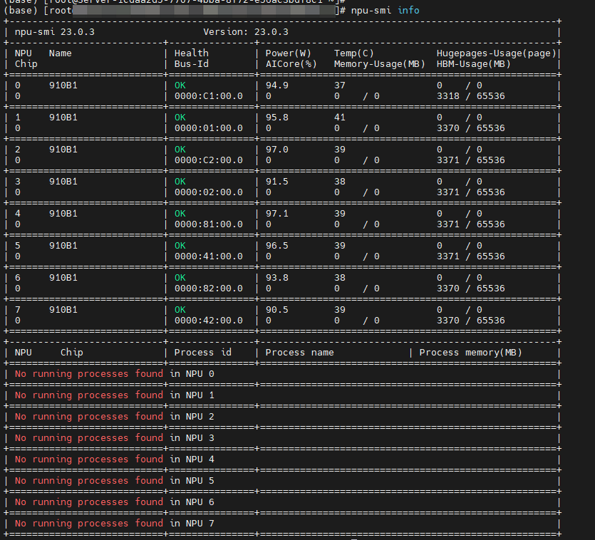
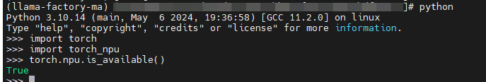

华为 NPU 适配
================

目前LLaMA-Factory 通过 torch-npu 库完成了对华为昇腾 910b 系列芯片的支持, 包含 32GB 和 64GB 两个版本。跟其他使用相比，会需要额外3个前置条件

1. 加速卡本身的驱动正常安装
#. CANN Toolkit 和 Kernels库正常安装
#. torch-npu 库正常安装

为方便昇腾用户使用，LLaMA-Factory 提供已预装昇腾环境的 :ref:`install_form_docker` 及自行安装昇腾环境，:ref:`install_form_pip` 两种方式，可按需自行选择：

.. _install_form_docker:

Docker 安装
---------------------

.. note::
  请确保宿主机已根据昇腾卡型号成功安装对应的固件和驱动，可参考 `快速安装昇腾环境 <https://ascend.github.io/docs/sources/ascend/quick_install.html>`_ 指引。

LLaMA-Factory 提供 :ref:`docker_compose` 和 :ref:`docker_build` 两种构建方式，请根据需求选择其一。

.. _docker_compose:

使用 docker-compose 构建并启动 docker 容器
~~~~~~~~~~~~~~~~~~~~~~~~~~~~~~~~~~~~~~~~~~~~~~~

进入 LLaMA-Factory 项目中存放 Dockerfile 及 docker-compose.yaml 的 docker-npu 目录：

.. code-block:: shell

  cd docker/docker-npu

构建 docker 镜像并启动 docker 容器：

.. code-block:: shell

  docker-compose up -d

进入 docker 容器：

.. code-block:: shell

  docker exec -it llamafactory bash

.. _docker_build:

不使用 docker-compose
~~~~~~~~~~~~~~~~~~~~~~~~~~~~~~~~~~~~~~~~~~~~~~~

使用 docker build 直接构建 docker 镜像：

.. code-block:: shell

  docker build -f ./docker/docker-npu/Dockerfile --build-arg INSTALL_DEEPSPEED=false --build-arg PIP_INDEX=https://pypi.org/simple -t llamafactory:latest .

启动 docker 容器：

.. code-block:: shell

  docker run -dit \
  -v ./hf_cache:/root/.cache/huggingface \
  -v ./ms_cache:/root/.cache/modelscope \
  -v ./data:/app/data \
  -v ./output:/app/output \
  -v /usr/local/dcmi:/usr/local/dcmi \
  -v /usr/local/bin/npu-smi:/usr/local/bin/npu-smi \
  -v /usr/local/Ascend/driver:/usr/local/Ascend/driver \
  -v /etc/ascend_install.info:/etc/ascend_install.info \
  -p 7860:7860 \
  -p 8000:8000 \
  --device /dev/davinci0 \
  --device /dev/davinci_manager \
  --device /dev/devmm_svm \
  --device /dev/hisi_hdc \
  --shm-size 16G \
  --name llamafactory \
  llamafactory:latest

进入 docker 容器：

.. code:: shell

  docker exec -it llamafactory bash

.. _install_form_pip:

自行 pip 安装
-------------------

自行 pip 安装时， python 版本建议使用3.10， 目前该版本对于 NPU 的使用情况会相对稳定，其他版本可能会遇到一些未知的情况

依赖1: NPU 驱动
~~~~~~~~~~~~~~~~~~~~

根据昇腾卡型号安装对应的固件和驱动，可参考 `快速安装昇腾环境 <https://ascend.github.io/docs/sources/ascend/quick_install.html>`_ 指引，使用 ``npu-smi info`` 验证如下

依赖2: NPU 开发包
~~~~~~~~~~~~~~~~~~~~~

.. list-table:: 相关包建议版本
   :widths: 30 10 60
   :header-rows: 1

   * - Requirement
     - Minimum
     - Recommend
   * - CANN
     - 8.0.RC1
     - 8.0.RC1
   * - torch
     - 2.1.0
     - 2.1.0
   * - torch-npu
     - 2.1.0
     - 2.1.0.post3
   * - deepspeed
     - 0.13.2
     - 0.13.2

可以按照 `快速安装昇腾环境 <https://ascend.github.io/docs/sources/ascend/quick_install.html>`_ 指引，或者使用以下命令完成快速安装：

.. code-block:: bash

    # replace the url according to your CANN version and devices
    # install CANN Toolkit
    wget https://ascend-repo.obs.cn-east-2.myhuaweicloud.com/Milan-ASL/Milan-ASL%20V100R001C17SPC701/Ascend-cann-toolkit_8.0.RC1.alpha001_linux-"$(uname -i)".run
    bash Ascend-cann-toolkit_8.0.RC1.alpha001_linux-"$(uname -i)".run --install

    # install CANN Kernels
    wget https://ascend-repo.obs.cn-east-2.myhuaweicloud.com/Milan-ASL/Milan-ASL%20V100R001C17SPC701/Ascend-cann-kernels-910b_8.0.RC1.alpha001_linux.run
    bash Ascend-cann-kernels-910b_8.0.RC1.alpha001_linux.run --install

    # set env variables
    source /usr/local/Ascend/ascend-toolkit/set_env.sh

依赖3: torch-npu
~~~~~~~~~~~~~~~~~~~~

依赖3建议在安装 LLaMA-Factory 的时候一起选配安装， 把 ``torch-npu`` 一起加入安装目标，命令如下

.. code-block:: bash

    pip install -e ".[torch-npu,metrics]"

依赖校验
~~~~~~~~~~~~~~~~
3个依赖都安装后，可以通过如下的 python 脚本对 ``torch_npu`` 的可用情况做一下校验

.. code-block:: python

    import torch
    import torch_npu
    print(torch.npu.is_available())

预期结果是打印true

安装校验
----------------------

使用以下指令对 LLaMA-Factory × 昇腾的安装进行校验：

.. code-block:: shell
  
  llamafactory-cli env

如下所示，正确显示 LLaMA-Factory、PyTorch NPU 和 CANN 版本号及 NPU 型号等信息即说明安装成功。

.. code-block:: shell
  
  - `llamafactory` version: 0.8.2.dev0
  - Platform: Linux-4.19.90-vhulk2211.3.0.h1543.eulerosv2r10.aarch64-aarch64-with-glibc2.31
  - Python version: 3.10.14
  - PyTorch version: 2.1.0 (NPU)
  - Transformers version: 4.41.2
  - Datasets version: 2.19.2
  - Accelerate version: 0.31.0
  - PEFT version: 0.11.1
  - TRL version: 0.9.4
  - NPU type: xxx
  - CANN version: 8.0.RC2.alpha001

在 LLaMA-Factory 中使用 NPU 
----------------------------------
前面依赖安装完毕和完成校验后，即可像文档的其他部分一样正常使用 ``llamafactory-cli`` 的相关功能， NPU 的使用是无侵入的。主要的区别是需要修改一下命令行中 设备变量使用
将原来的 Nvidia 卡的变量 ``CUDA_VISIBLE_DEVICES`` 替换为 ``ASCEND_RT_VISIBLE_DEVICES``， 类似如下命令

.. code-block:: bash

    ASCEND_RT_VISIBLE_DEVICES=0,1 llamafactory-cli train examples/train_lora/llama3_lora_sft.yaml

FAQ
~~~~~~~~~~~~~

1. 设备指定
^^^^^^^^^^^^^^^

**Q：NPU 调用失败**

A: 通过以下两种方法排查解决：

1. 通过 ``ASCEND_RT_VISIBLE_DEVICES`` 环境变量指定昇腾 NPU 卡，如 ``ASCEND_RT_VISIBLE_DEVICES=0,1,2,3`` 指定使用 0，1，2，3四张 NPU 卡进行微调/推理。

.. hint::
    
    昇腾 NPU 卡从 0 开始编号，docker 容器内也是如此；
    如映射物理机上的 6，7 号 NPU 卡到容器内使用，其对应的卡号分别为 0，1

2. 检查是否安装 torch-npu，建议通过 ``pip install -e '.[torch-npu,metrics]'`` 安装 LLaMA-Factory。

2. 推理报错
^^^^^^^^^^^^^^^

**Q：使用昇腾 NPU 推理报错 RuntimeError: ACL stream synchronize failed, error code:507018**

A: 设置 do_sample: false，取消随机抽样策略。

比如在 yaml 中修改

.. code-block:: yaml

    model_name_or_path: meta-llama/Meta-Llama-3-8B-Instruct
    template: llama3
    do_sample: false

比如在 api 请求中指定

.. code-block:: bash

    curl http://localhost:8000/v1/chat/completions \
    -H "Content-Type: application/json" \
    -d '{
        "model": "meta-llama/Meta-Llama-3-8B-Instruct",
        "messages": [
            {"role": "user", "content": "Hello"}
        ],
        "do_sample": false
    }'

关联 issues：

- https://github.com/hiyouga/LLaMA-Factory/issues/3840

3. 微调/训练报错
^^^^^^^^^^^^^^^^^^^

**Q：使用 ChatGLM 系列模型微调/训练模型时，报错 NotImplementedError: Unknown device for graph fuser**

A: 在 modelscope 或 huggingface 下载的 repo 里修改 ``modeling_chatglm.py`` 代码，取消 torch.jit 装饰器注释

关联 issues：

- https://github.com/hiyouga/LLaMA-Factory/issues/3788
- https://github.com/hiyouga/LLaMA-Factory/issues/4228

**Q：微调/训练启动后，HCCL 报错，包含如下关键信息：**

.. code-block:: shell

        RuntimeError: [ERROR] HCCL error in: torch_npu/csrc/distributed/ProcessGroupHCCL.cpp:64
    [ERROR] 2024-05-21-11:57:54 (PID:927000, Device:3, RankID:3) ERR02200 DIST call hccl api failed.
    EJ0001: 2024-05-21-11:57:54.167.645 Failed to initialize the HCCP process. Reason: Maybe the last training process is running.
            Solution: Wait for 10s after killing the last training process and try again.
            TraceBack (most recent call last):
            tsd client wait response fail, device response code[1]. unknown device error.[FUNC:WaitRsp][FILE:process_mode_manager.cpp][LINE:290]
            Fail to get sq reg virtual addr, deviceId=3, sqId=40.[FUNC:Setup][FILE:stream.cc][LINE:1102]
            stream setup failed, retCode=0x7020010.[FUNC:SyncGetDevMsg][FILE:api_impl.cc][LINE:4643]
            Sync get device msg failed, retCode=0x7020010.[FUNC:GetDevErrMsg][FILE:api_impl.cc][LINE:4704]
            rtGetDevMsg execute failed, reason=[driver error:internal error][FUNC:FuncErrorReason][FILE:error_message_manage.cc][LINE:53]

A: 杀掉 device 侧所有进程，等待 10s 后重新启动训练。

关联 issues：

- https://github.com/hiyouga/LLaMA-Factory/issues/3839

.. **Q：微调 ChatGLM3 使用 fp16 报错 Gradient overflow. Skipping step Loss scaler reducing loss scale to ...；使用 bf16 时 'loss': 0.0, 'grad_norm': nan**
.. https://github.com/hiyouga/LLaMA-Factory/issues/3308

**Q：使用 TeleChat 模型在昇腾 NPU 推理时，报错 AssertionError： Torch not compiled with CUDA enabled**

A: 此问题一般由代码中包含 cuda 相关硬编码造成，根据报错信息，找到 cuda 硬编码所在位置，对应修改为 NPU 代码。如 ``.cuda()`` 替换为 ``.npu()`` ； ``.to("cuda")`` 替换为  ``.to("npu")`` 

**Q：模型微调遇到报错 DeviceType must be NPU. Actual DeviceType is: cpu，例如下列报错信息**

.. code-block:: shell

    File "/usr/local/pyenv/versions/3.10.13/envs/x/lib/python3.10/site-packages/transformers-4.41.1-py3.10.egg/transformers/generation/utils.py", line 1842, in generate
        result = self._sample(
    File "/usr/local/pyenv/versions/3.10.13/envs/x/lib/python3.10/site-packages/transformers-4.41.1-py3.10.egg/transformers/generation/utils.py", line 2568, in _sample
        next_tokens = next_tokens * unfinished_sequences + \
    RuntimeError: t == c10::DeviceType::PrivateUse1 INTERNAL ASSERT FAILED at "third_party/op-plugin/op_plugin/ops/base_ops/opapi/MulKernelNpuOpApi.cpp":26, please report a bug to PyTorch. DeviceType must be NPU. Actual DeviceType is: cpu
    [ERROR] 2024-05-29-17:04:48 (PID:70209, Device:0, RankID:-1) ERR00001 PTA invalid parameter

A: 此类报错通常为部分 Tensor 未放到 NPU 上，请确保报错中算子所涉及的操作数均在 NPU 上。如上面的报错中，MulKernelNpuOpApi 算子为乘法算子，应确保 next_tokens 和 unfinished_sequences 均已放在 NPU 上。

昇腾实践参考
-----------------

如需更多 LLaMA-Factory × 昇腾实践指引，可参考 `全流程昇腾实践 <https://ascend.github.io/docs/sources/llamafactory/example.html>`_ 。
