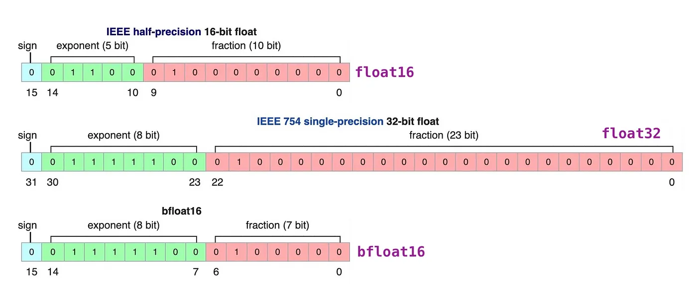

量化
================

随着语言模型规模的不断增大，其训练的难度和成本已成为共识。
而随着用户数量的增加，模型推理的成本也在不断攀升，甚至可能成为限制模型部署的首要因素。
因此，我们需要对模型进行压缩以加速推理过程，而模型量化是其中一种有效的方法。

大语言模型的参数通常以高精度浮点数存储，这导致模型推理需要大量计算资源。
量化技术通过将高精度数据类型存储的参数转换为低精度数据类型存储，
可以在不改变模型参数量和架构的前提下加速推理过程。这种方法使得模型的部署更加经济高效，也更具可行性。

   `source <https://www.cerebras.net/machine-learning/to-bfloat-or-not-to-bfloat-that-is-the-question/>`_

浮点数一般由3部分组成：符号位、指数位和尾数位。指数位越大，可表示的数字范围越大。尾数位越大、数字的精度越高。

量化可以根据何时量化分为：后训练量化和训练感知量化，也可以根据量化参数的确定方式分为：静态量化和动态量化。

PTQ
---------------------
后训练量化（PTQ, Post-Training Quantization）一般是指在模型预训练完成后，基于校准数据集（calibration dataset）确定量化参数进而对模型进行量化。

GPTQ
~~~~~~~~~~~~~~
GPTQ(Group-wise Precision Tuning Quantization)是一种静态的后训练量化技术。"静态"指的是预训练模型一旦确定,经过量化后量化参数不再更改。GPTQ 量化技术将 fp16 精度的模型量化为 4-bit ,在节省了约 75% 的显存的同时大幅提高了推理速度。
为了使用GPTQ量化模型，您需要指定量化模型名称或路径，例如 ``model_name_or_path: TechxGenus/Meta-Llama-3-8B-Instruct-GPTQ``

QAT
-------------------

在训练感知量化（QAT, Quantization-Aware Training）中，模型一般在预训练过程中被量化，然后又在训练数据上再次微调，得到最后的量化模型。

AWQ
~~~~~~~~~~~~~~~~~~~~
AWQ（Activation-Aware Layer Quantization）是一种静态的后训练量化技术。其思想基于：有很小一部分的权重十分重要，为了保持性能这些权重不会被量化。
AWQ 的优势在于其需要的校准数据集更小，且在指令微调和多模态模型上表现良好。
为了使用 AWQ 量化模型,您需要指定量化模型名称或路径，例如 ``model_name_or_path: TechxGenus/Meta-Llama-3-8B-Instruct-AWQ``

AQLM
------------------
AQLM（Additive Quantization of Language Models）作为一种只对模型权重进行量化的PTQ方法，在 2-bit 量化下达到了当时的最佳表现，并且在 3-bit 和 4-bit 量化下也展示了性能的提升。
尽管 AQLM 在模型推理速度方面的提升并不是最显著的，但其在 2-bit 量化下的优异表现意味着您可以以极低的显存占用来部署大模型。

OFTQ
---------------------
OFTQ(On-the-fly Quantization)指的是模型无需校准数据集，直接在推理阶段进行量化。OFTQ是一种动态的后训练量化技术. OFTQ在保持性能的同时。
因此，在使用OFTQ量化方法时，您需要指定预训练模型、指定量化方法 ``quantization_method`` 和指定量化位数 ``quantization_bit``
下面提供了一个使用bitsandbytes量化方法的配置示例：

.. code-block:: yaml

    model_name_or_path: meta-llama/Meta-Llama-3-8B-Instruct
    quantization_bit: 4
    quantization_method: bitsandbytes  # choices: [bitsandbytes (4/8), hqq (2/3/4/5/6/8), eetq (8)]

bitsandbytes
~~~~~~~~~~~~~~~
区别于 GPTQ, bitsandbytes 是一种动态的后训练量化技术。bitsandbytes 使得大于 1B 的语言模型也能在 8-bit 量化后不过多地损失性能。
经过bitsandbytes 8-bit 量化的模型能够在保持性能的情况下节省约50%的显存。

HQQ
~~~~~~~~~~~~~
依赖校准数据集的方法往往准确度较高，不依赖校准数据集的方法往往速度较快。HQQ（Half-Quadratic Quantization）希望能在准确度和速度之间取得较好的平衡。作为一种动态的后训练量化方法，HQQ无需校准阶段，
但能够取得与需要校准数据集的方法相当的准确度，并且有着极快的推理速度。

EETQ
~~~~~~~~~~~~~~
EETQ(Easy and Efficient Quantization for Transformers)是一种只对模型权重进行量化的PTQ方法。具有较快的速度和简单易用的特性。

