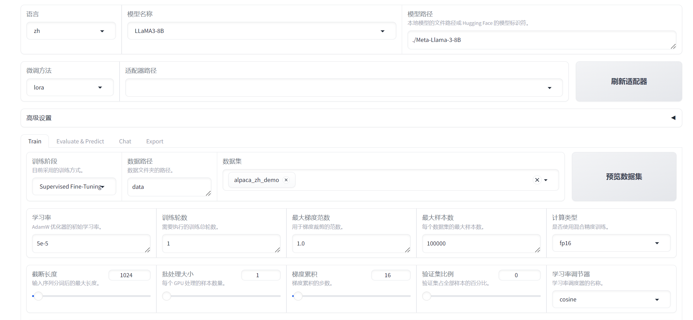

WebUI
========================

LLaMA-Factory 支持通过 WebUI 零代码微调大语言模型。
在完成 :ref:`安装 <installation>` 后，您可以通过以下指令进入 WebUI:

.. code-block:: bash

    llamafactory-cli webui

WebUI 主要分为四个界面：训练、评估与预测、对话、导出。

训练
--------------------------------------

在开始训练模型之前，您需要指定的参数有：

#. 模型名称及路径
#. 训练阶段
#. 微调方法
#. 训练数据集
#. 学习率、训练轮数等训练参数
#. 微调参数等其他参数
#. 输出目录及配置路径

随后，您可以点击 ``开始`` 按钮开始训练模型。

.. note:: 

    关于断点重连:适配器断点保存于 ``output_dir`` 目录下，请指定 **适配器路径** 以加载断点继续训练。

    如果您需要使用自定义数据集，请在 ``data/data_info.json`` 中添加自定义数据集描述并确保 :ref:`数据集格式<数据处理>` 正确，否则可能会导致训练失败。

评估预测与对话
------------------------------

模型训练完毕后，您可以通过在评估与预测界面通过指定 **模型** 及 **适配器** 的路径在指定数据集上进行评估。

您也可以通过在对话界面指定 **模型**、 **适配器** 及 **推理引擎** 后输入对话内容与模型进行对话观察效果。

导出
------------------

如果您对模型效果满意并需要导出模型，您可以在导出界面通过指定 **模型**、 **适配器**、 **分块大小**、 **导出量化等级及校准数据集**、 **导出设备**、 **导出目录** 等参数后点击 ``导出`` 按钮导出模型。

