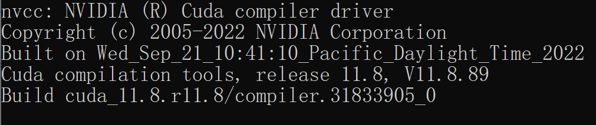
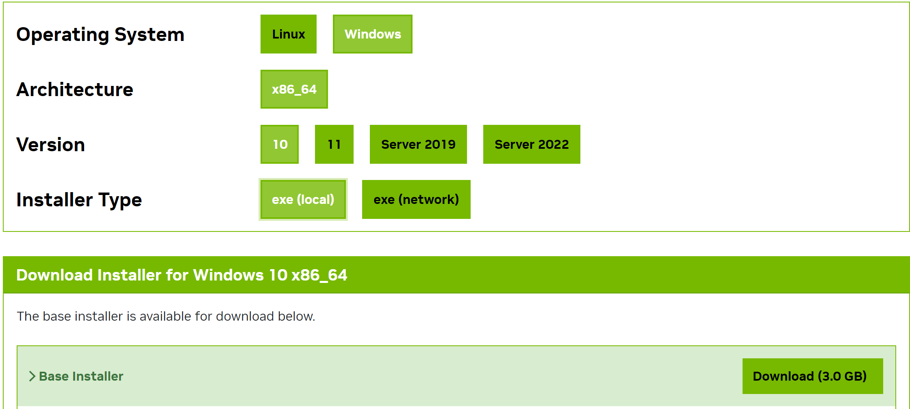
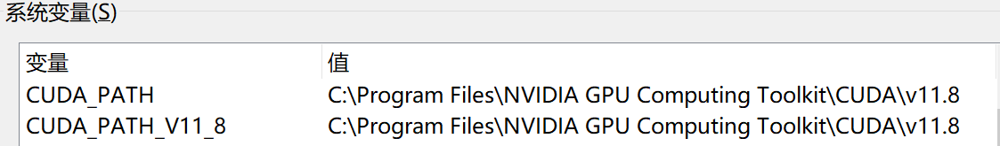

# 安装

## CUDA环境安装

CUDA 是由 NVIDIA 创建的一个并行计算平台和编程模型，它让开发者可以使用NVIDIA的GPU进行高性能的并行计算。

首先，在[https://developer.nvidia.com/cuda-gpus](https://developer.nvidia.com/cuda-gpus)查看您的GPU是否支持CUDA

### Linux

#### 前置需求

1. 保证当前Linux版本支持CUDA. 在命令行中输入`uname -m && cat /etc/*release`，应当看到类似的输出

   ```bash
   x86_64
   DISTRIB_ID=Ubuntu
   DISTRIB_RELEASE=22.04
   ```

2. 检查是否安装了`gcc`. 在命令行中输入`gcc --version`，应当看到类似的输出

   ```bash
   gcc (Ubuntu 11.4.0-1ubuntu1~22.04) 11.4.0
   ```

3. 在以下网址下载所需的CUDA,这里推荐12.2版本.[https://developer.nvidia.com/cuda-gpus](https://developer.nvidia.com/cuda-12-2-0-download-archive).注意需要根据上述输出选择正确版本

   

   如果您之前安装过CUDA(例如为12.1版本)，需要先使用`sudo /usr/local/cuda-12.4/bin/cuda-uninstaller`卸载。如果该命令无法运行，可以直接:

   ```bash
    sudo rm -r /usr/local/cuda-12.1/
    sudo apt clean && sudo apt autoclean
   ```

   卸载完成后运行以下命令并根据提示继续安装：

   ```bash
   wget https://developer.download.nvidia.com/compute/cuda/12.2.0/local_installers/cuda_12.2.0_535.54.03_linux.run
   sudo sh cuda_12.2.0_535.54.03_linux.run
   ```

   **注意**：在确定CUDA自带驱动版本与GPU是否兼容之前，建议取消Driver的安装。	

1. 完成后输入`nvcc -V`检查是否出现对应的版本号，若出现则安装完成。

​	  

### Windows

1. 打开**设置**，在**关于**中找到**Windows 规格**保证系统版本在以下列表中：

   | 支持版本号                    |
   | ----------------------------- |
   | Microsoft Windows 11 21H2     |
   | Microsoft Windows 11 22H2-SV2 |
   | Microsoft Windows 11 23H2     |
   | Microsoft Windows 10 21H2     |
   | Microsoft Windows 10 22H2     |
   | Microsoft Windows Server 2022 |

2. 选择对应的版本下载并根据提示安装。

3. 打开cmd输入`nvcc -V`，若出现类似内容则安装成功。

​		否则，检查系统环境变量，保证CUDA被正确导入。			


## LLaMA-Factory安装

在安装LLaMA-Factory之前，请确保您安装了下列依赖：

| Mandatory    | Minimum | Recommend |
| ------------ | ------- | --------- |
| python       | 3.8     | 3.11      |
| torch        | 1.13.1  | 2.3.0     |
| transformers | 4.41.2  | 4.41.2    |
| datasets     | 2.16.0  | 2.19.2    |
| accelerate   | 0.30.1  | 0.30.1    |
| peft         | 0.11.1  | 0.11.1    |
| trl          | 0.8.6   | 0.9.4     |

| Optional     | Minimum | Recommend |
| ------------ | ------- | --------- |
| CUDA         | 11.6    | 12.2      |
| deepspeed    | 0.10.0  | 0.14.0    |
| bitsandbytes | 0.39.0  | 0.43.1    |
| vllm         | 0.4.3   | 0.4.3     |
| flash-attn   | 2.3.0   | 2.5.9     |

运行以下指令以安装LLaMA-Factory及其依赖：

```bash
git clone --depth 1 https://github.com/hiyouga/LLaMA-Factory.git
cd LLaMA-Factory
pip install -e ".[torch,metrics]"
```

如果出现环境冲突，请尝试使用`pip install --no-deps -e .`解决

## LLaMA-Factory校验

完成安装后，可以通过使用`llamafactory-cli version`来快速校验安装是否成功

如果您能成功看到类似下面的界面，就说明安装成功了。

## LLaMA-Factory高级选项

### Extra Dependency

#### Windows

##### QLoRa

如果您想在Windows上启用量化LoRA（QLoRA），请根据您的CUDA版本选择适当的[bitsandbytes](https://github.com/jllllll/bitsandbytes-windows-webui/releases/tag/wheels)发行版本。

```shell
pip install https://github.com/jllllll/bitsandbytes-windows-webui/releases/download/wheels/bitsandbytes-0.41.2.post2-py3-none-win_amd64.whl
```

##### flash-attn

如果您要在Windows平台上启用FlashAttention-2，请根据您的CUDA版本选择适当的[flash-attention](https://github.com/bdashore3/flash-attention/releases)发行版本。

------------------------------

如果您有更多需求，请安装对应依赖。

| 名称             | 描述                                                         |
| ---------------- | ------------------------------------------------------------ |
| **torch**        | 一个开源的深度学习框架，广泛用于机器学习和人工智能研究中。   |
| **torch_npu**    | 昇腾开发的Ascend Extension for PyTorch插件，为使用PyTorch框架的开发者提供昇腾AI处理器的超强算力 |
| **metrics**      | 用于评估和监控机器学习模型性能。                             |
| **deepspeed**    | 用于分布式训练与推理                                         |
| **bitsandbytes** | 用于压缩和加速深度学习模型                                   |
| **vllm**         | 大语言模型高速推理框架                                       |
| **galore**       | 低显存实现全参微调                                           |
| **badam**        | 低显存实现全参微调                                           |
| **gptq**         | 对类GPT大语言模型的量化                                      |
| **awq**          | 对大语言模型进行激活感知权重量化                             |
| **aqlm**         | 对大语言模型进行增量语言模型量化                             |
| **qwen**         | 部署Qwen模型                                                 |
| **modelscope**   | 支持多种机器学习模型                                         |
| **quality**      |                                                              |